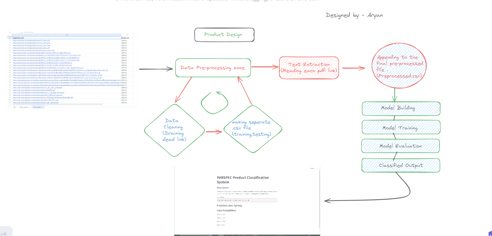
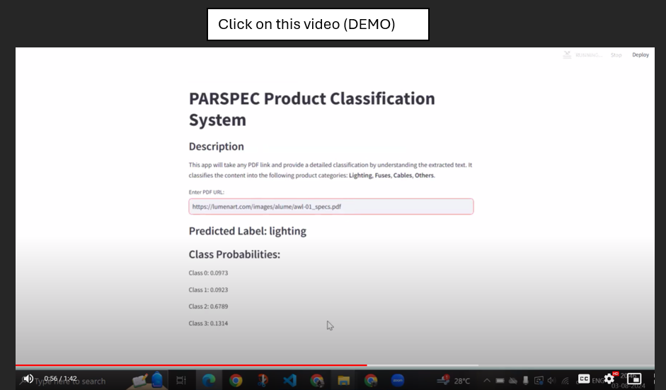
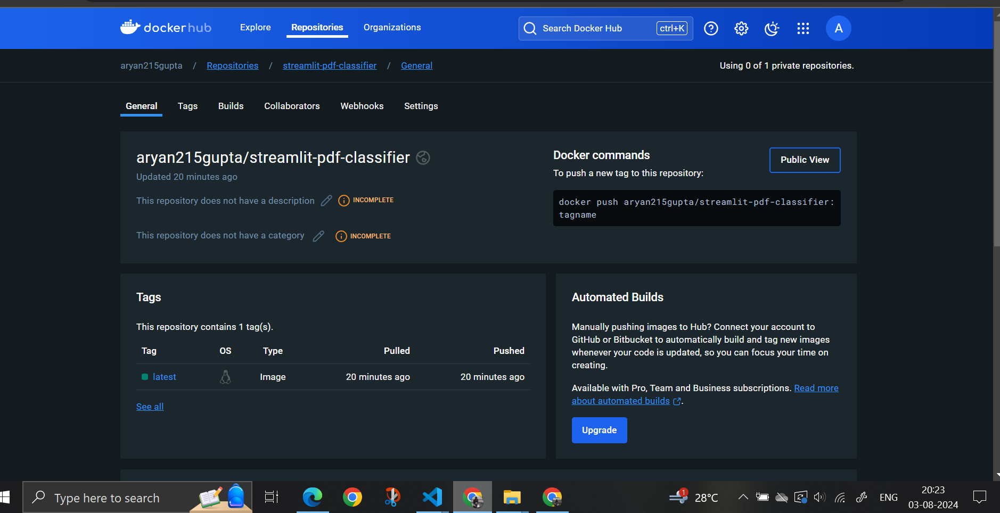

# PARSPEC Product Classification System

This project is a Streamlit application that classifies PDF documents into one of four categories: Lighting, Fuses, Cables, Others. It extracts text from a provided PDF URL, preprocesses the text, and uses a machine learning model to classify the document.

## Project Setup

### Prerequisites

- Docker installed on your machine (Optional)
- A Docker Hub account (Optional)

### Steps

1. Clone this repository to your local machine.
2. Navigate to the project directory.
3. Create a Docker image and push it to Docker Hub: (Optional)

    ```bash
    docker build -t <your_dockerhub_username>/streamlit-pdf-classifier:latest .
    docker push <your_dockerhub_username>/streamlit-pdf-classifier:latest
    ```

4. Run the Docker container locally: (Optional)

    ```bash
    docker run -p 8501:8501 <your_dockerhub_username>/streamlit-pdf-classifier:latest
    ```

5. Open your web browser and navigate to `http://localhost:8501`. (Optional)

6. create a python environment in you IDE(VsCode) and Run the following command listed below :-
     
    (i)  python -m venv parspec
    (ii) pip install -r requirements.txt
    (iii) streamlit run app.py

7. Check the project with this end-to-end deployed link :-
   
### Directory Structure

/your_project_directory
│
├── text_extraction.py
├── preprocessing.py
├── model_training.py
├── app.py
├── requirements.txt
├── logfile.log
├── Dockerfile
├── README.md
├── images
│ ├── product_design.png
│ ├── project_output.mp4
│ └── project_scalability.png


## Product Design



## Project Output

[](https://drive.google.com/file/d/1WtxAbMczafr_hVm_U-ZQgEvPY8o2Walh/view?usp=drive_link)


## Project Deployment and Scalability



### Developed by: Aryan Agrahari


